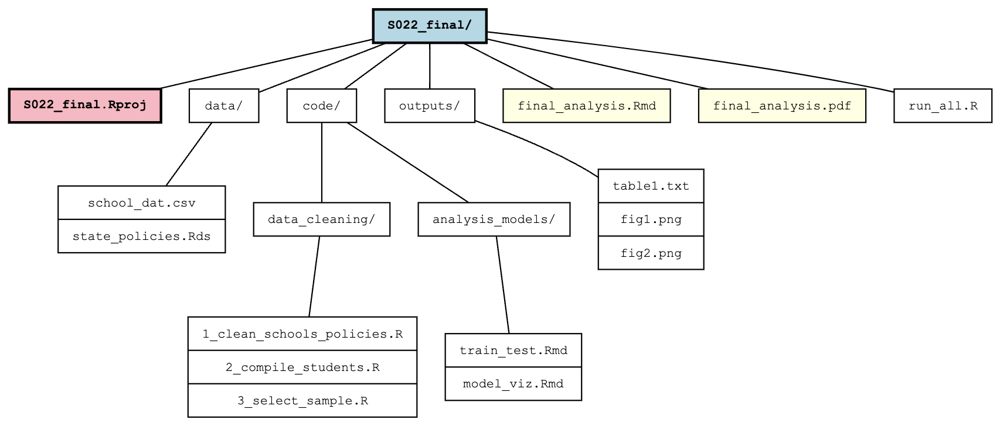

# Organizing Projects for Research & Collaboration {.unnumbered}

## S022 Final Projects {.unnumbered}

**In addition to submitting the slides for your final S022 project, you will also submit a zipped project folder containing all of the data, code, and analysis used to create your presentation.** Below, we outline some best practices for keeping your projects organized as they develop, with the ultimate goal of sharing a clean, replicable project to the teaching team at the end of the semester.

## Organizational File Structure {.unnumbered}

Often, complex projects involve several scripts that take a variety inputs and generate an array of outputs. Ultimately, an intentional file structure that is specific to your project can be extremely helpful in keeping your code organized in a way that facilitates collaboration and replication. As a starting point, consider using something like the basic file structure below:

{width=90%}

##### An organized project contains:  {.unnumbered}

* All data files associated with the final analysis
* The cleaning scripts to prepare, merge, and process code for the final analysis 
* All tables and outputs associated with the final analysis
* A markdown file (ex. `final_analysis.Rmd`) and rendered PDF (ex. `final_analysis.pdf`) report with the code and products for your research project 
* An `.Rproj` file, which bundles the code together and manages relative file paths within the project. 

The goal of your project's structure is to be clearly understood by collaborators or your future self. 

## Using R Projects {.unnumbered}

R Projects are an extremely useful tool for organizing code and keeping the variables and data in your environment contained across separate research projects. You can read more about Projects in [R for Data Science (2e), Chapter 6](https://r4ds.hadley.nz/workflow-scripts.html#projects). 

The main thing to know is that R Projects are one of the most effective ways to format code for collaborators to share across different computers and file locations. 

### The `here` package {.unnumbered}

In working with R files, you have probably come across the `getwd()` and `setwd()` functions. However, R Projects obviate the need for manually setting a working directory by identifying the location of your R project (and the associated `.Rproj` file) as the root directory that all of your code will reference. The `here` package leverages this feature by automatically detecting your project root, allowing you to build file paths that will work consistently across different computers.

For example, the code below will find the project root associated with this Quarto handout! 

```{r message=FALSE}
library(here)
here::here()
```

### Relative paths with `here()` {.unnumbered}

By centering your code around the `.Rproj` file, you can write code that seamlessly runs on multiple collaborators' computers, regardless of the Project's location on those computers.

##### Good: {.unnumbered}

Uses the `here()` function to set relative file paths to locations in the project directory. Note that this example creates separate sub-directories for raw and cleaned data. A nice way to take it easy on your collaborators and your future self! 

```{r eval=FALSE}
school_dat <- read_csv(here::here("data/raw_data/school_data_2025.csv")) 
...
# Cleaning code here
saveRDS(clean_dat, here::here("data/clean_data/clean_school_data.Rds"))
```

##### Bad: {.unnumbered}

Imports data from far-flung locations, uses absolute file paths that will break on others' computers or if the project directory changes. 

```{r eval=FALSE}
school_dat <- read_csv("/Users/noradelaney/Downloads/school_data_2025.csv")
...
# Cleaning code here
saveRDS(clean_dat, 
        "/Users/noradelaney/Documents/s022_final_proj/data/clean_school_data.Rds")
```


```{r fig.width=5.5, fig.height=3, echo=FALSE, eval=FALSE, results="hide"}
library(DiagrammeR)
grViz("
  digraph project_structure {
    // Graph settings for top-down tree layout
    graph [rankdir = TB, fontname = 'Courier New', fontsize = 10, nodesep = 0.3, ranksep = 0.5]
    
    // Edge settings for tree-like appearance
    edge [arrowhead = none, color = darkgray]
    
    // Node settings with monospace font for ASCII-like look
    node [shape = box, style = filled, fillcolor = white, fontname = 'Courier New', fontsize = 10, 
          height = 0.3, margin = '0.15,0.1', color = darkgray]
    
    // Root and main directories
    project [label = <<b>S022_final/</b>>, fillcolor = lightblue, style = 'filled,bold']
    
    // First level items
    rproj [label = <<b>S022_final.Rproj</b>>, shape = box, style = 'filled,bold', 
           fillcolor = lightpink, color = darkred]
    data [label = 'data/']
    code [label = 'code/']
    outputs [label = 'outputs/']
    final_model [label = 'final_analysis.Rmd', fillcolor = lightyellow]
    final_pdf [label = 'final_analysis.pdf', fillcolor = lightyellow]
    run_all [label = 'run_all.R', fillcolor = 'white', style = 'filled']
    
    // Second level items
    data_files [label = '{school_dat.csv | state_policies.Rds}', shape = record]
    
    data_cleaning [label = 'data_cleaning/']
    analysis_models [label = 'analysis_models/']
    
    data_cleaning_files [label = '{1_clean_schools_policies.R | 2_compile_students.R | 3_select_sample.R}', shape = record]
    analysis_models_files [label = '{train_test.Rmd | model_viz.Rmd}', shape = record]
    
    output_files [label = '{table1.txt | fig1.png | fig2.png}', shape = record]
    
    // Connections
    project -> {rproj data code outputs final_model final_pdf run_all} [weight = 10]
    data -> data_files [weight = 5]
    code -> {data_cleaning analysis_models} [weight = 5]
    data_cleaning -> data_cleaning_files [weight = 2]
    analysis_models -> analysis_models_files [weight = 2]
    outputs -> output_files [weight = 2]
    
    // Tree-like layout constraints
    {rank = same; rproj; data; code; outputs; final_model; final_pdf; run_all}
    {rank = same; data_files; data_cleaning; analysis_models; output_files}
    {rank = same; data_cleaning_files; analysis_models_files}
  }
")
```


